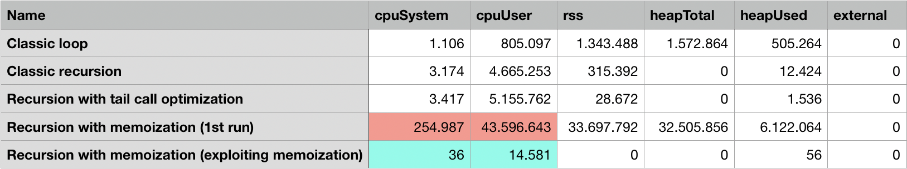

# Recursion: performance analysis

There are several implementations of recursion compared:

- classic recursive implementation,
- recursive with [tail call](https://en.wikipedia.org/wiki/Tail_call) optimization,
- recursive with memoization,
- classic loop (as "placebo control").

The sum of arithmetical progression `0, 1, 2,...` was chosen as a Guinea pig. Following **parameters** were taken into accounting:

- processor time (`cpuUser` corresponds to running time in microseconds),
- memory usage (see [NodeJS documentation](https://nodejs.org/api/process.html#process_process_memoryusage) for detailed info).

## Scripts

No `package.json`, no dependencies needed.

Run `node test.js` to check if `sum...()` implementations are correct.

Run `node index.js` to fetch the runtime data. They are printed as CSV. Results fetched on my machine reside in `./results`.

Pretty similar calculations (~~sum~~ &rarr; factorial) have been performed for browser on [JSPerf platform](https://jsperf.com/factorials-recursion/2).

## Results

## Analysis

Visit https://melnyk.site/post/16 for detailed analysis.
